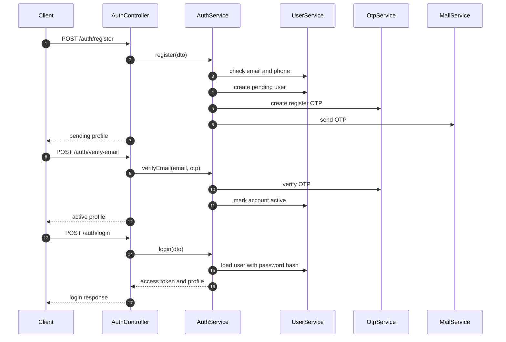

# Authentication

Authentication is implemented in `src/modules/auth`. The module uses email and
password registration with OTP verification, JWT access tokens, Google OAuth2,
profile management, and password reset through OTP.

## Endpoints

| Method | Path | Auth | Description |
| --- | --- | --- | --- |
| `POST` | `/auth/register` | Public | Create a pending customer account and send register OTP. |
| `POST` | `/auth/login` | Public | Validate credentials and return JWT access token. |
| `POST` | `/auth/logout` | JWT | Stateless logout response. Client discards token. |
| `GET` | `/auth/me` | JWT | Return authenticated profile. |
| `PATCH` | `/auth/me` | JWT | Update profile fields and optional password. |
| `POST` | `/auth/verify-email` | Public | Verify register OTP and activate account. |
| `POST` | `/auth/resend-otp` | Public | Send a new register OTP for pending accounts. |
| `POST` | `/auth/forgot-password` | Public | Send reset password OTP when the account exists and is usable. |
| `POST` | `/auth/reset-password` | Public | Verify reset OTP and replace password. |
| `GET` | `/auth/google` | Public | Redirect to Google OAuth2. |
| `GET` | `/auth/google/callback` | Public | Complete Google login and redirect to frontend callback. |

## Register Flow

1. Client submits `POST /auth/register`.
2. Backend checks unique email and optional unique phone.
3. Password is hashed with bcrypt.
4. User is created with:
   - `role = customer`
   - `status = pending_verification`
   - `authProvider = email`
5. OTP is stored in `otp_verifications`.
6. OTP is sent by `MailService`.
7. Client submits `POST /auth/verify-email` with email and OTP.
8. Backend validates OTP and updates the user to `active`.

Example register payload:

```json
{
  "fullName": "Nguyen Van A",
  "email": "customer@example.com",
  "phone": "0900000000",
  "password": "Customer123!",
  "gender": "unknown",
  "dateOfBirth": "2000-01-01",
  "address": "Ho Chi Minh City"
}
```

Example verify payload:

```json
{
  "email": "customer@example.com",
  "otp": "123456"
}
```

## Login Flow

1. Client submits `POST /auth/login`.
2. Backend loads user by normalized email with `passwordHash` explicitly selected.
3. Password is compared with bcrypt.
4. Login is rejected when:
   - account does not exist
   - password is invalid
   - account is still pending verification
   - account is suspended or deleted
5. `lastLoginAt` is updated.
6. JWT is signed with `{ sub, email, role }`.

Example login payload:

```json
{
  "email": "customer@example.com",
  "password": "Customer123!"
}
```

## JWT Usage

Protected routes expect:

```http
Authorization: Bearer <accessToken>
```

`JwtStrategy` loads the user by `sub` and rejects missing or inactive users.
Route permissions are handled with `JwtAuthGuard`, `RolesGuard`, and `@Roles()`.

## Logout

`POST /auth/logout` is protected by JWT, but logout is stateless. The backend
does not persist refresh tokens or token revocation records. The client should
delete the access token locally.

## Profile

`GET /auth/me` returns the current user profile without `passwordHash`.

`PATCH /auth/me` supports updating personal profile fields. If `password` is
included, the backend hashes and stores the new password.

## Password Reset

1. `POST /auth/forgot-password` accepts an email.
2. Unknown, suspended, or deleted users are ignored to reduce account enumeration.
3. Known usable users receive an OTP for `reset_password`.
4. `POST /auth/reset-password` validates the OTP and updates the password.
5. A pending account becomes active after a successful password reset.

## Google OAuth2

Google OAuth2 is configured with:

- `GOOGLE_CLIENT_ID`
- `GOOGLE_CLIENT_SECRET`
- `GOOGLE_CALLBACK_URL`
- `FRONTEND_URL`

On callback, the backend creates or activates a matching Google user, signs a
JWT, and redirects to:

```text
<FRONTEND_URL>/auth/callback?accessToken=<token>
```

## OTP Mail Modes

Mail behavior is controlled by `MAIL_DRIVER`.

| Value | Behavior |
| --- | --- |
| `console` | Logs OTP in backend logs. Useful for development and demos without a mail domain. |
| `resend` | Sends real OTP email through Resend. Requires `RESEND_API_KEY` and verified sender/domain setup. |

When `MAIL_DRIVER` is omitted, non-production defaults to `console` and
production defaults to `resend`.

## Sequence


