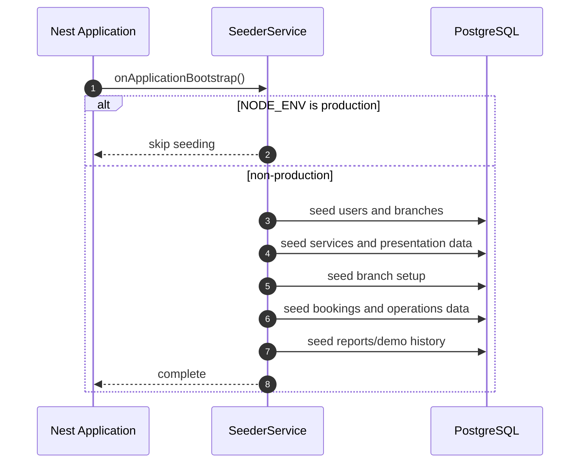

# Seeding

Development seed data is handled by `SeederService`, which implements
`OnApplicationBootstrap`. Seeding runs automatically on application bootstrap
when `NODE_ENV !== production`.

Seeders are designed to be idempotent. They check existing rows before inserting
so repeated local restarts do not create duplicate core records.

## Bootstrap Order

`SeederService.onApplicationBootstrap()` currently runs:

1. owner account
2. customers
3. staff
4. managers
5. branches
6. services
7. service presentation overrides/additional services
8. branch setup
9. bookings
10. payments
11. reviews
12. health records
13. inventory
14. promotions
15. discount codes
16. treatment courses and sessions
17. conversations
18. complaints
19. schedules
20. performance data

## Accounts

### Owner

| Field | Value |
| --- | --- |
| Email | `owner@gmail.com` |
| Password | `12345678qwerty` |
| Role | `owner` |
| Status | `active` |

Change this before any shared or production deployment.

### Customers

Seeded customer password:

```text
Customer123!
```

Seeded customers:

- `lan.nguyen@gmail.com`
- `minh.tran@gmail.com`
- `hoa.le@gmail.com`
- `bao.pham@gmail.com`
- `mai.hoang@gmail.com`

### Staff

Seeded staff password:

```text
Staff123!
```

Seeded staff:

- `thu.vo@aura-spa.com`
- `duc.nguyen@aura-spa.com`
- `bich.tran@aura-spa.com`
- `long.pham@aura-spa.com`

### Managers

Seeded manager password:

```text
Manager123!
```

Seeded managers:

- `huong.manager@aura-spa.com`
- `khanh.manager@aura-spa.com`
- `phuong.manager@aura-spa.com`

## Branches

Seeded branches include active branches in Ho Chi Minh City, Hanoi, and Da Nang,
plus a maintenance branch for owner status-management demos.

| Code | City | Status |
| --- | --- | --- |
| `HCM-Q1` | Ho Chi Minh City | `active` |
| `HCM-Q7` | Ho Chi Minh City | `active` |
| `HAN-HK` | Hanoi | `active` |
| `HCM-TD` | Ho Chi Minh City | `maintenance` |
| `DAN-HC` | Da Nang | `active` |
| `DAN-MK` | Da Nang | `active` |
| `DAN-NHS` | Da Nang | `active` |

## Services

Base service data includes facial, body, nail, and archived/demo services.
Service presentation seeding then:

- updates selected service names, slugs, descriptions, prices, durations, and image URLs
- creates additional presentation services for massage and package offerings

Service statuses include:

```text
draft
active
inactive
archived
```

## Branch Setup

`BranchSetupSeeder` creates:

- opening hours for each branch
- branch-staff assignments
- branch-service mappings
- booking slot configs

Default opening and slot config behavior:

| Day | Time Range | Slot Step | Max Bookings |
| --- | --- | --- | --- |
| Monday to Saturday | 09:00-20:00 | 60 minutes | 3 |
| Sunday | 10:00-17:00 | 60 minutes | 2 |

All base services are enabled at all seeded branches unless later changed.

## Demo Business Data

The seeders create data for these modules:

- bookings in several statuses
- invoices and payments
- published reviews
- customer health records
- branch inventory and transactions
- active and draft promotions
- discount codes such as `WELCOME2026` and `Q1FIRST`
- treatment courses and sessions
- guest conversations and staff replies
- complaints
- schedule requests and active staff schedules
- performance data for ranking and revenue reports

## Sequence


